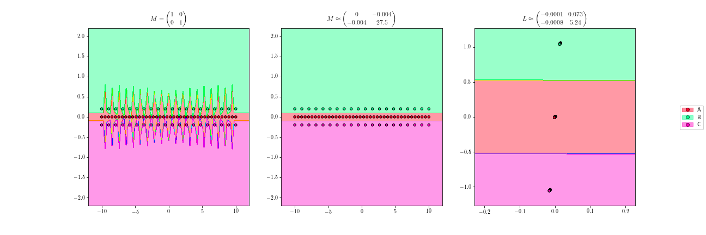
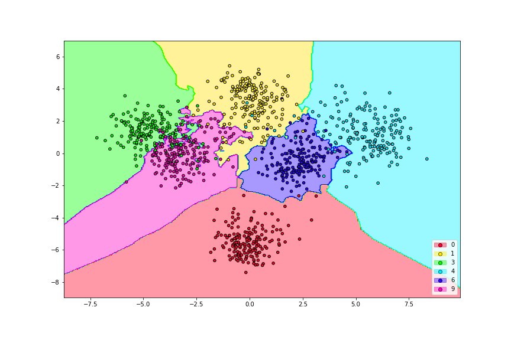

Applications
============

Improving similarity learning classifiers
-----------------------------------------

Learning a distance that fits the data properly will improve the accuracy of distance-based classifiers.

   1-NN classification with euclidean distance (left), 1-NN classification after learning a distance (center) and the equivalent projection learned (right)

Dimensionality reduction
------------------------

Many of the distance metric learning algorithms can learn projections onto low dimensional spaces. Dimensionality reduction improves the classifier eficiency, reduces overfitting and avoids problems such a the curse of dimensionality present in some similarity classifiers.

   The `digits <http://scikit-learn.org/stable/auto_examples/datasets/plot_digits_last_image.html>`_ dataset (64 features) projected onto a plane with a distance metric learning algorithm.

