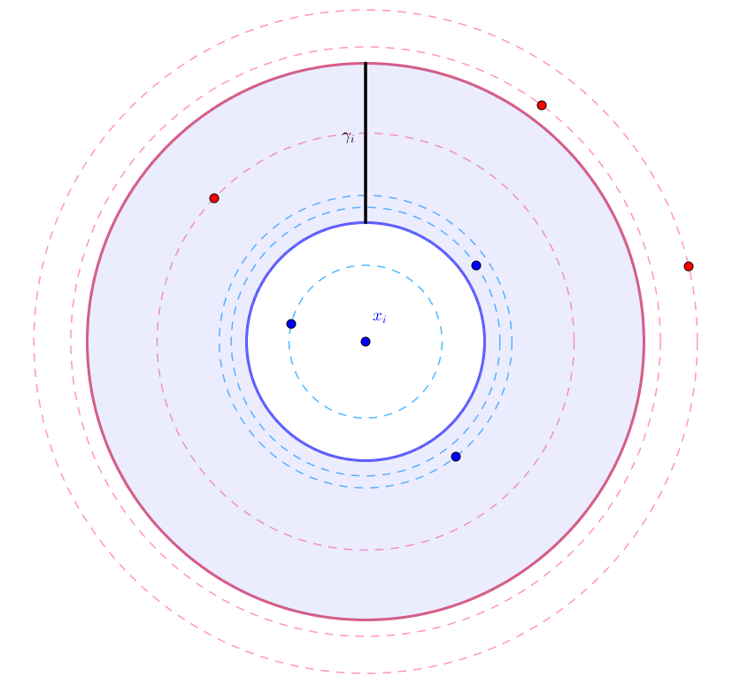

Average Neighborhood Margin Maximization (ANMM)
===============================================

A dimensionality reduction technique that maximizes the sum of the average neighborhood margins for each point in the dataset. The average neighborhood margin for a point is calculated as the average of the difference between the sum of distances to the nearest neighbors with different class and the sum of distances to the nearest neighbors with same class.

Watch the full ANMM documentation `here <dml.html#module-dml.anmm>`_.

Images
------

   The geometry of the average neighborhood margin.

References
----------

Fei Wang and Changshui Zhang. “Feature extraction by maximizing the average neighborhood
margin”. In: Computer Vision and Pattern Recognition, 2007. CVPR’07. IEEE Conference on.
IEEE. 2007, pages 1-8.
