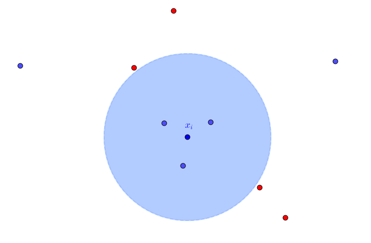

Large Margin Nearest Neighbors (LMNN)
=====================================

A distance metric learning algorithm for nearest neighbors classification. It learns a metric that pulls the neighbor candidates (*target_neighbors*) near, while pushes near data from different classes (*impostors*) out of the target neighbors margin.

Watch the full LMNN documentation `here <dml.html#module-dml.lmnn>`_.

Images
------
.. figure:: _static/lmnn1.png

   Impostors and target neighbors

   Data geometry after pulling target neighbors and pushing impostors.

References
----------

Kilian Q Weinberger and Lawrence K Saul. “Distance metric learning for large margin nearest
neighbor classification”. In: Journal of Machine Learning Research 10.Feb (2009), pages 207-244.