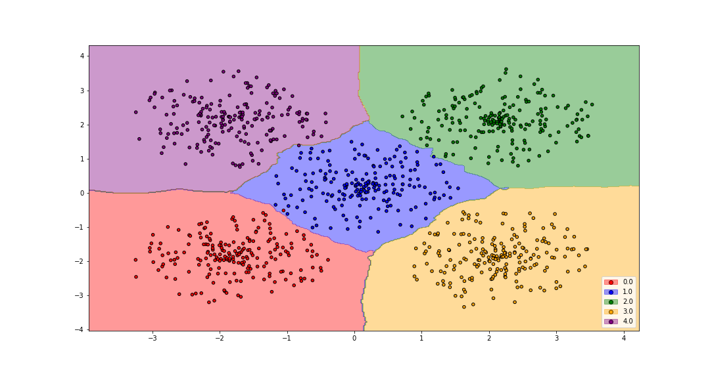

Distance metric and classifier plots
====================================

The module `dml_plot <dml.html#module-dml.dml_plot>`_ provides several functions for plotting the regions determined by a classifier and by a distance metric learning combined with a classifier. The `classifier_plot <dml.html#dml.dml_plot.classifier_plot>`_ function allows to plot the class regions determined by any classifier. With the `dml_plot <dml.html#dml.dml_plot.dml_plot>`_ function, a metric can be added to modify the classifier region. This metric can be added via a linear transformation, a metric PSD matrix or a distance metric learning algorithm that will learn it. A special function, when the classifier is the nearest neighbors classifier, is also available. Use in this case `knn_plot <dml.html#dml.dml_plot.knn_plot>`_.

Analogous versions of the previous functions are available to plot simultaneously different pairs of attributes. For this case, watch the functions `classifier_pairplots <dml.html#dml.dml_plot.classifier_pairplots>`_, `dml_pairplots <dml.html#dml.dml_plot.dml_pairplots>`_ and `knn_pairplots <dml.html#dml.dml_plot.knn_pairplots>`_. Multiple plots, considering different classifiers or distances, can be done with the function `dml_multiplot <dml.html#dml.dml_plot.dml_multiplot>`_. There is also a 3D classifier plot (still in development), see `classifier_plot_3d <dml.html#dml.dml_plot.classifier_plot_3d>`_.

All these libraries use internally Python's `matplotlib <https://matplotlib.org/>`_ library.

Images
------

.. image:: _static/plot2.png

.. image:: _static/plot7.png

.. image:: _static/plot8.png

.. image:: _static/plot11.png

.. image:: _static/plot14.png
